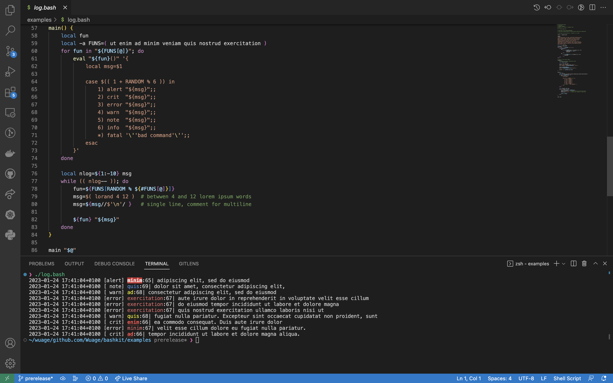

# [![\Nuage][wuage-img]][wuage]

`Bashkit` is an opiniated scripting model and framework for `Bash` `5.x`. It is intended
to help writing more robust scripts in which unhandled errors are preferably fatal.
It does so by enforcing and exploiting selected bashisms and sometimes moving away
from IEEE POSIX P1003.2/ISO 9945.2. It supplements bash as a collection of modules
akin to a script development library. It consists mostly in pure bash functions
with few to no dependencies.

* **Fail Fast Scripting** and **Error-Handling** support.
* **Advanced Logging** functions.
* Add **ANSI colors** to your script output.
* **Modular** to fit different use cases: modules can be included whenever you need them.
* **Lightweight**, you won't notice any performance penalty.


When using **Bashkit**, you will still recognise your Bash scripts:

```sh
source bashkit.bash

isint() {
    local n
    printf -v n '%d' "${1:-}" &> /dev/null \
    || raise "not an int"
}

isint "abc" \
|| error

2022-11-28 12:22:51+0100 [error] isint:5| not an int
```

Bashkit as a pure bash functions collection will fit right into your environment:

<p align="center">
  
</p>

[wuage-img]:     ./doc/images/wuage_badge.svg
[wuage]:         https://bashkit.wuage.io

## Who Uses Bashkit

Here at [Wuage](https://github.com/Wuageorg), we are building a fast and low energy cloud infrastructure stack. In our world, we are used to write and deploy scripts at a massive scale. Those scripts are useful to assert node states, deploy new projects and features and even mass-administer a number of machines at once. The thing we don't want is to see our scripts *improvising* ops on their own! We would rather prefer them to fail as soon and loudly as possible in case of an unfortunate event.

In our past lives we had to officially push `Bash` away because it was deemed unsuitable for our day to day ops. Instead of using It, we had to write `Python` scripts along with a decent load of `Yaml` descriptions. Our work was fed to a gigantic puzzler and it was hopefully delivered to production. But as time passed, we were eventually writing... `Bash` scripts again usually to overcome some gigantic limitations or counter-performances.

This is why we developed `Bashkit`: we believe that with a few pushes here and there `Bash` is a premium scripting tool!

Whatever the purpose of your scripts, if they are meant to do something non-interactively, fail fast and report, you will find `Bashkit` useful.

If you start using `Bashkit` and find it worthy, drop us a message and we will publish a list of users right here!

## How It Works
Bashkit comes with 7 core and 11 standard function modules. A bashkit script is a bash script that, at some point sources bashkit and modules and starts calling their functions. Custom modules are easy to write and module boilerplates are kept small. Nonetheless, a proper error handling surely requires editing.

Core modules implement:

1. Revised control flows
2. ANSI color for the masses
3. Error code handling
4. Exhaustive error scheme
5. Advanced logging routines
6. Thorough signal trap handling
7. Stateful bashkit versionning

Standard modules bring:

1. Easy array manipulations
2. Advanced checking, including variable type checking
3. Curl download integration
4. Yes/no interaction support
5. Json conversions
6. Patch integration
7. File permissions conversion
8. Readlink as a function
9. Shopt stacking
10. Semver comparison
11. String manipulation

> A module can be loaded either when sourcing `Bashkit` or by calling `bashkit::load(1)`
<details><summary><b>Show example</b></summary>

```sh
source bashkit.bash check shopt # load bashkit along with check and shopt modules

bashkit::load array # load array module
```
</details>

## Bashkit Scripting

Bashkit favors `fail` `fast` like scripting patterns: by combining Conditional Constructs [[...]] and ((...)) with errcode and handlers scripts can achieve useful and robust behaviors. Bashkit scripts can setup LIFO traps on any signal and cleanup command easily enables deferred actions upon script exit. It is also very easy to add text color to outputs.

### Logging

Bashkit as a proper software framework offers a logging system. A bashkit script can and should record software events in a structured way. Bashkit follows syslog(1) levels to implement logging routines:

| routine | panic | alert | crit | error | warn | note | info | debug |
| ------ | :------: | :------: | :------: | :------: | :------: | :------: | :------: | :------: |
| level | 0 | 1 | 2 | 3 | 4 | 5 | 6 | 7

Logging level is controlled either by setting the global variable `$LOGLEVEL` beforehand or by calling `logging:setlevel` at runtime. Default logging level is `INFO/6`. As expected, a logging routine displays a message when the current logging level is *lower or equal* to its own, otherwise the message is silenced
but planned side-effects occur (see `errcode`).

<details><summary><b>Show example</b></summary>

```sh
bash-5.2$ cat hello.bash
#!/usr/bin/env bash
source ${SOME_PATH_TO_BASHKIT}/bashkit.bash
info 'hello world!'

bash-5.2$ bash -c ./hello.bash
2022-10-12 18:27:33+0200 [ info] ./hello.bash:3| hello world!
```

</details>

> there's a bashkit routine named `info`. It shadows `info(1)` the bash
info document reader. If you need to use `info(1)`, call it with
`command` `info` `[args]`.


### Standard logging

Standard logging happens on `stderr`, when on a supported terminal it is colorized by default.
Whenever color is unsuitable, it can be disabled by setting the global variable `$NO_COLOR`. As shown in `hello.bash` example,
standard logging routines display a default format:

    YYYY-MM-DD HH:MM:SS+hhmm [LEVEL] ORIGIN:LINENO| MSG

| field | format |
|-|--------|
| STAMP| ISO-8601 extended offset date-time format |
| LEVEL| routine name in a padded string of length 5, enclosed in brackets |
| ORIGIN| \$FUNCNAME or \$FILENAME or main or bash |
| LINENO| integer of calling time \$LINENO value |
| MSG| arbitrary bash expandable string after "\| " |

### JSON logging

JSON logging happens on `stderr`, it is enabled by setting the global variable `$JSON` beforehand. When activated, it replaces standard logging output. Messages are emitted in [NDJSON](http://ndjson.org) format and consist in valid json values with no color and a fix layout:

```sh
'{ "date": "STAMP", "level": "LEVEL", "func": "ORIGIN", "lineno": "LINENO", "text": "MSG" }\n'
```

Fields STAMP, LEVEL, ..., MSG are similar to standard logging except for LEVEL that is not padded nor bracketed. They are all enclosed in double-quotes.

<details><summary><b>Show example</b></summary>

```sh
bash-5.2$ cat hello.bash
#!/usr/bin/env bash
source ${SOME_PATH_TO_BASHKIT}/bashkit.bash
info 'hello world!'

bash-5.2$ bash -c 'JSON=1 ./hello.bash'
{ "date": "2022-10-13 17:35:04+0200", "level": "info", "func": "./hello.bash", "lineno": "3", "text": "hello world!" }
```
</details>

### Panicking

`panic` and `fatal` are special logging routines that stop the ordinary flow of control and begin *panicking*:

- `panic` calls bash `exit` with code 1
- `fatal` calls bash `exit` with a previously set value (see `errcode`)
- registered `cleanup` functions (see `trap`) execute normally in LIFO order until the last one
- at that point, the script crashes

Panics can only be initiated by invoking `panic` or `fatal` directly.

### Report and Trace

Report mode is controlled by setting the global variable `$REPORT`. When activated, the script will dump a stack-trace and exit whenever an error is detected by bashkit.

Trace mode is controlled by `$TRACE`. When activated:

- bash is put in `xtrace` mode
- additional program counter details are displayed by `$PS4`
- `report` mode is activated
- logging level is set to `DEBUG/7`

## Error handling

Bashkit proposes a unique yet classical error handling coding patterns. They extend bash error semantic by exploiting conditional statements. They assemble into error handling pipelines. Bashkit uses a trap to catch errors as they arise. If they are handled locally, the flow of control proceeds. Otherwise, the error is bubbled up the calling stack until handled. When an unhandled error reaches its calling-stack root, the calling script usually crashes. In Bashkit, almost *all errors are fatal*.

### Discussion
Handling error in bash is difficult: The query "error handling in bash", on the biggest search engine, returns +88M links as of October 2022. On [SO](https://stackoverflow.com/questions/64786/error-handling-in-bash), a closely related question, asked in 2008, was viewed +410k times and received answers as late as early 2022. Eventually, it was deemed "opinion-based" by moderators and closed to more answers.

Bash basic exit status handling is flawed by decisions made early during bash design along with heavy POSIX constraints on the subject. The resulting `set -e` mode is unsatisfactory and error-prone: whenever scripts are thought to fail fast, they could just behave in unintuitive ways, fallen into one of the many bash pitfalls.

Bashkit helps scripts to efficiently handle errors or fail fast in most of the cases. One should be aware that some bash quirks are simply unreachable to address within bash itself. Don't do this:

```sh
diff <(sort A) <(sort B)
```

### Error code mapping
Bashkit defines an error code mapping that closely follows [bash definition](https://www.gnu.org/software/bash/manual/html_node/Exit-Status.html) and adds additional constraints to it:

- an error is a global variable with a name prefixed by "E_" followed by words connected with "_" ex. `$E_FAILURE` but not ~~`$E_FAILURE_`~~
- such a variable contains a *uniquely* assigned integer, a preset ex. `E_FAILURE=1`
- bashkit owns some of the preset errors
- bash is said to own some other preset errors
- signal is a shorcut to bash/[129-192]
- ownership is conventional and not enforced in any way
- the proposed mapping is declared at runtime
- *custom* errors can be registered at runtime

| range | names | owner | note |
|--|------|-|-------|
| 0-3 | E_SUCCESS - E_UNSUPPORTED | bash |
| 4-7 | N/A| unused |
| 8-32 | E_BASHKIT - E_CUSTOM | bashkit | highest bit is 3 or 4 |
| 33-123| custom names | user | highest bit is 5 or 6 but err < 124 |
| 124-128| E_TIMEOUT - E_INVALID_EXIT | bash |
| 129-192| E_SIGHUP - E_SIGRTMAX | signal | highest bit is 7 low bits for signum |
| 193-254| N/A | unused |
| 255| E_OUT_OF_RANGE | bash |
> bashkit offers tools to manipulate errors (see `error`)


### Flow of control with true
Using `true` as a control flow mechanism is already a bash idiom:

```sh
#!/usr/bin/env bash
up_the_game
rm some_random_file_that_could_not_exist || true
echo "all went well!"
```

Under `errcode`, the bashkit error handling system, you can do the same:

```sh
source bashkit.bash

up_the_game
rm some_random_file_that_could_not_exist || true
echo "all went well!"
```

`true`, is the most basic `errcode handler` of all. Using `true` to handle an error means this error is irrelevant to the flow of control.

> `return` and `exit` are also `errcode` compatible so existing constructs are preserved.

### raise, catch and resume

```sh
check_cmd() {
    command -v "${cmd}" &> /dev/null
}
```
`command` is a bash `builtin`. When used with `-v` option, it prints a description similar to the `type` builtin.
It returns exit status `0` if `$cmd` is executable or fails with `1` if not. As stated before, under `errcode` (bashkit error handling support) when `$cmd` is not available, it is a fatal error.
To be more on point, `check_cmd` should be more flexible than silently failing (thanks to redirecting to `/dev/null`), it could at least `log` an error. Consider the `bashkit idiom` to just do that:

```sh
check_cmd() {
    local cmd=$1
    command -v "${cmd}" &> /dev/null \
    || error "${cmd} not found"
}

bash-5.2$ bash -c 'source bashkit.bash; check_cmd(){... ; check_cmd inexistent'
2022-10-17 16:18:02+0200 [error] bash:1| inexistent not found
```
It is slightly better but still lacks some genericity: what if we just want to know if a command exists and proceed with a workaround if not? Enter `raise` that ultimately enables more efficient error handling patterns:

```sh
source bashkit.bash

check_cmd() {
    local cmd=$1
    command -v "${cmd}" &> /dev/null \
    || raise "${cmd} not found"
}

check_cmd inexistent \
|| error
```
Invoked like this, `raise` position a `message` along with the `exit status` *before* returning to the caller. It becomes the caller's responsibility to chose what to do when `check_cmd` fails. For now, as previously, the script logs the error and then crashes. But a more convenient flow is within reach by using `catch`:

```sh
source bashkit.bash

check_cmd isint \
|| {
  catch
  isint() {
     printf '%d' "$1" > /dev/null 2>&1 \
     || raise "invalid number: $1"
  }
}

isint 1 \
&& info integer \
|| error
```

In this situation, when `check_cmd` raises a failure, the `catch` block is able to:
  1) consume this failure
  2) define a replacement function

`isint` also complies to `errcode`: the last invocation logs an informational "integer" (rather than error log "invalid number").

Now consider this example where `maybe` has 50% chances of failure:

```sh
source bashkit.bash

maybe()(( $1 < RANDOM%100 ))

maybe 50 \
&& echo yep \
|| echo nope # not an errcode handler
```

Bashkit error handling trap will stop short right after the `maybe` call if it fails. In the long run, the script prints "yep" in one out of two runs but will never print "nope". Under `errcode` it does not work because `echo` is not an *errcode compatible handler*. The idiomatic way here, is to use `resume`:

```sh
source bashkit.bash

maybe()(( $1 < RANDOM%100 ))

maybe 50 \
&& echo yep \
|| resume echo nope
```

This time, the script will print either "yep" or "nope" with the same frequency. `resume` consumes the error and restores control to the command that immediately follows, in this case: `echo nope`.

#### not as a function

> Because bash unary negation operator `!` is not a command, `resume` can not transfer control to it. It can be replaced by `not`. `not` is defined to return the logical negation of its argument.

```sh
source bashkit.bash

maybe()(( $1 < RANDOM%100 ))
abort()(( RANDOM & 0x1 ))

maybe 50 \
|| resume not abort \
|| error 'can not proceed'
```

In the long run, this script will rather succeed (75%) than log an error and fail (25%).

### Unhandled errors

Bashkit can detect a set but unhandled error that otherwise would go silent. In this case, the script will  **crit** log the error:

```sh
source bashkit.bash extras

isint not_an_integer
```

When ran, the above script outputs:

```sh
bash-5.2$ ./noint.bash
2022-10-24 15:14:52+0200 [ crit] isint:33| invalid number
```

### Fail fast
[`Fail` `fast`](https://www.martinfowler.com/ieeeSoftware/failFast.pdf) is a simple technique that is known to ease finding most defects in a software. A software that fails fast, will stop visibly as soon as a problem occurs: bugs are easier to find and fix so, hopefully, fewer make it to production.

#### Assertions

Usually `assertions` are different from exceptions in the way that assertions can be turned off because they were believed useful during design and tuning development stages. Experience has proven them usefull even in production where *real* problems happen.

Bash has no support built-in support for *assertions*. Bashkit which is mostly written in pure-bash does not either implement a *per-se* assertion system: instead it *emulates* them using `conditional construcs` and `errcode`: Namely a tests followed by a `|| raise` pattern that exploits `raise` polymorphism *is* an `assertion`.

<details><summary><b>Show example</b></summary>

```sh
array::pick() {
    local -n A=$1
    local -n acc=${2:-__}

    local i=$(( RANDOM % ${#A[@]} ))
    printf -v acc '%s\n' "${A[i]}"
}
```

`array::pick` takes two bash [namerefs](https://www.gnu.org/software/bash/manual/html_node/Shell-Parameters.html). The first one points to an array `A` while the second, `acc`, is used to write out a random element of `A`. Here are the things that could go wrong within this function:
  1)  a wrong argument count (invocation mistake)
  2) `A` not pointing to an array
  3) `A` pointing to an empty array

Being a publicly exposed function of bashkit module `array`, `array::pick` should remediate these situations. The proper way is to add a bunch of tests akin to `assertions` and combine `errcode handlers` to always achieve a useful behavior:

```sh
source bashkit.bash

array::pick() {
    (( $# == 1 || $# == 2 )) \
    || raise "${E_PARAM_ERR}" 'incorrect invocation' \
    || fatal

    local -n A=$1
    local -n acc=${2:-__}

    check::vartype as A \
    || raise

    (( ${#A[@]} != 0 )) \
    || raise "${E_PARAM_ERR}" 'array is empty'

    local i=$(( RANDOM % ${#A[@]} ))
    printf -v acc '%s\n' "${A[i]}"
}
```

> This example also shows that `raise` is polymorphic.
>
> - the first test *asserts* that there is either a single or 2 arguments, if not the script `fatals` immediately with exit status `$E_PARAM_ERR` and a descriptive message
> - `local refnames` assignations can not fail by design: `$1` exists and `$2` has a default
> - bashkit `check::vartype` enables script to assert that `$A` refers to an *array that has been set*, if not the function (reraises the `check::vartype` failure to `array::pick` caller
> - next test *asserts* a non-empty array and once again, raises any failure to `array::pick` caller
> - at this point, there is no way the function could fail anymore and it will eventually select and copy a random element from `$A[@]` to `$acc`

</details>

### Traps and cleanup

In Bash, a process may choose to perform a different action, rather than exiting, upon receiving a signal. This is done by setting up a signal handler (or trap). The trap must be set before the signal is received. A process that receives a signal for which it has set a trap is said to have caught the signal.

The simplest signal handling a process can choose to perform is to ignore a signal. This is generally a *bad idea*, unless it is done for a very specific purpose. Ignoring signals often leads to runaway processes which consume all available CPU.

Bashkit `trap` module utilities extend bash command behavior. Namely, `trap::callback` enables a script to register *multiple callback functions or plain sources* that are called in LIFO order upon receiving selected signals.

More commonly, traps can be set up to intercept a fatal signal, perform cleanup, and then exit gracefully. For example, a program that creates temporary files might wish to remove them before exiting. If the program is forced to exit by a signal, it won't be able to remove the files unless it catches the signal.

Bashkit `cleanup` utility is a `trap::callback` wrapper dedicated to hook instructions to signal `EXIT/0`. It can be called anytime from anywhere in the script, registered functions will run in LIFO order at the script top level. As in bash, a mistake in a callback could abort the entire cleanup process but won't prevent the script from exiting.

<details><summary><b>Show example</b></summary>

```sh
source bashkit.bash

scratch=$(mktemp) \
|| exit

cleanup 'rm -f "${scratch}"'
```
</details>

> When `panicking`, a bashkit script will `cleanup` before exiting. But there are situations beyond reach, like arithmetic exceptions or uncatchable signals that can prevent `cleanup` to take place.

### Colors

Bashkit provides a `color` module. For now, this module only supports the [ANSI 8 colors model](https://en.wikipedia.org/wiki/ANSI_escape_code).

`color::encode` supports a tiny english color description language:

```{.numberLines}
description = color "text" [ color "background" ]
            | "reset"
color = ""
      | attributes brightness base
attributes=? a list of unique modifiers ?
modifiers = ""
          | "regular" | "bold" | "dim" | "italic" | "underlined"
          | "blinking"
          | modifiers, { modifiers }
brightness = ""
           | "bright"
base = "black" | "red" | "green" | "yellow" | "blue" | "magenta" | "cyan"
     | "white" | "default"
```

The smallest descriptions of all are `"text"` and `"reset"`. The later is always the ANSI `ESC[m` reset code while the former is the current system-defined default.

<details><summary><b>Show example</b></summary>

```sh
source bashkit.bash

color::encode bold green text; bold_green=${__}
color::encode reset; reset=${__}

printf "%b%s%b" "${bold_green}" NATURE "${reset} does not hurry, yet everything is accomplished\n"
```

>  - descriptions are literals, they have no quote
>  - after a successful encoding, ANSI code is stord in `${__}`
>  - `%b` is the required verb for an escape code when colorizing with `printf`
>  - any compatible terminal that receives such codes will interpret them as color commands
</details>

Declaring colors can be a tidy task, the following example shows how to build a *color palette*:

```sh
source bashkit.bash

declare -A COLPAL=(  # color palette
  [panic]='underlined blinking bold white text red background'
  [alert]='bold white text red background'
  [crit]='underlined bold red text'
  [fatal]='bold red text'
  [error]='red text'
  [warn]='yellow text'
  [note]='blue text'
  [info]='green text'
  [debug]='magenta text'
  [reset]='reset'
)

color::table COLPAL
```

> The demonstrated palette is actually used by bashkit `logging` routines.

When called on a bash *dictionary* (ie. associative array), `color::table` will substitute, in place, each description by a computed ANSI *escape sequence*. The resulting dictionary is to be used later as a `lookup table`.
